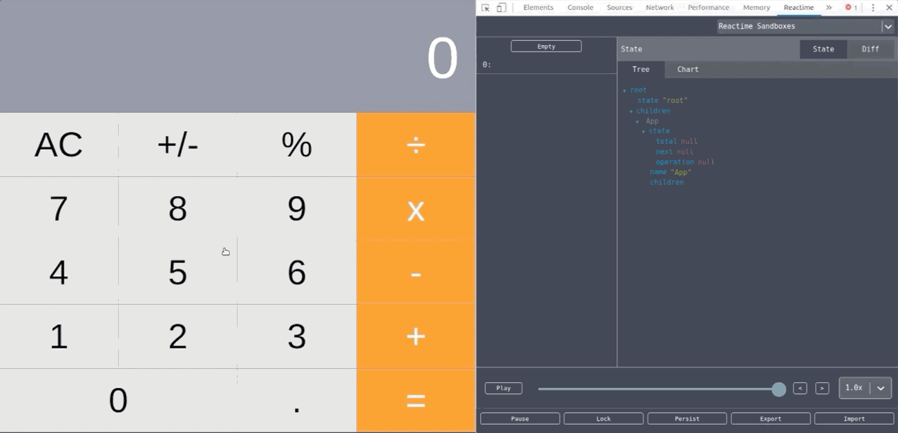

<p align="center">
  
</p>

<h1 align="center">State Debugger for React</h1>

[](https://github.com/oslabs-beta/reactime) [](https://travis-ci.com/oslabs-beta/reactime) [](http://badge.fury.io/js/reactime) [](https://david-dm.org/oslabs-beta/reactime#info=dependencies) [](https://david-dm.org/oslabs-beta/reactime?type=dev) [](https://snyk.io/test/github/oslabs-beta/reactime)





Reactime is a debugging tool for React developers. It records state whenever it is changed and allows the user to jump to any previously recorded state.

This tool is for React apps using stateful components and prop drilling, and has beta support for Context API, conditional state routing, Hooks (useState, useEffect) and functional components.

The latest release extends the core functionality by including support for TypeScript applications, improving the user experience through more declarative titles in the actions panel, and extending support for components with conditional state fields. The testing suite has also been expanded with the inclusion of a Sandbox utility to aid future expansion as well as additional E2E and integration tests with Puppeteer and React Testing Library.

After installing the Reactime, you can test its functionalities in the following demo repositories:

- [Calculator](https://joshua0308.github.io/calculator/)
- [Bitcoin Price Index](http://reactime-demo2.us-east-1.elasticbeanstalk.com)

Reactime was nominated for the Productivity Booster award at [React Open Source Awards 2020](https://osawards.com/react/)!

## Installation

Two parts are required for this tool to function: a [**Chrome extension**](https://chrome.google.com/webstore/detail/react-time-travel/cgibknllccemdnfhfpmjhffpjfeidjga) and an [**NPM package**](https://www.npmjs.com/package/reactime).

1. Install the Reactime [extension](https://chrome.google.com/webstore/detail/reactime/cgibknllccemdnfhfpmjhffpjfeidjga) from Chrome Web Store. Alternatively, use `src/extension/build/build.zip` for manual installation in [Developer mode](https://developer.chrome.com/extensions/faq#faq-dev-01). Turn on 'Allow access to file URLs' in extension details page if testing locally.

2. Install the [NPM package](https://www.npmjs.com/package/reactime) in your application's root directory. 

```
npm i reactime
```

3. Call the library method on your root container after rendering your App.

```
import reactime from 'reactime';

const rootContainer = document.getElementById('root');
ReactDOM.render(<App />, rootContainer);

reactime(rootContainer);
```

4. For experimental concurrent mode support.

```
import reactime from 'reactime';

const rootContainer = ReactDOM.createRoot(document.getElementById('root'));
rootContainer.render(<App />);
reactime(rootContainer);
```

5. Done! That's all you have to do to link your React project to our library.

## How to Use

After installing both the Chrome extension and the NPM package, just open up your project in the browser.

Then open up your Chrome DevTools and navigate to the Reactime tab.

## Features

### Recording

Whenever state is changed (whenever setState or useState is called), this extension will create a snapshot of the current state tree and record it. Each snapshot will be displayed in Chrome DevTools under the Reactime panel.

### Viewing

You can click on a snapshot to view your app's state. State can be visualized in a JSON or a tree. Also, snapshots can be diffed with the previous snapshot, which can be viewed under the Diff tab.

### Jumping

Jumping is the most important feature of all. It allows you to jump to any previous recorded snapshots. Hitting the jump button on any snapshot will change the DOM by setting their state.

### TypeScript Support

Reactime offers beta support for TypeScript applications using stateful class components and functional components with useState hooks.  Further testing and development is required for custom hooks, Context API, and Concurrent Mode.

### Additional Features

- multiple tree graph branches depicting state changes
- tree graph hover functionality to view state changes
- ability to pan and zoom tree graph
- multiple tabs support
- a slider to move through snapshots quickly
- a play button to move through snapshots automatically
- a pause button, which stops recording each snapshot
- a lock button to freeze the DOM in place. setState will lose all functionality while the extension is locked
- a persist button to keep snapshots upon refresh (handy when changing code and debugging)
- export/import the current snapshots in memory
- declarative titles in the actions panel
- extended support for components with conditional state fields
- a Sandbox utility to aid future expansion

## Authors

- **Carlos Perez** - [@crperezt](https://github.com/crperezt)
- **Edwin Menendez** - [@edwinjmenendez](https://github.com/edwinjmenendez)
- **Gabriela Jardim Aquino** - [@aquinojardim](https://github.com/aquinojardim)
- **Gregory Panciera** - [@gpanciera](https://github.com/gpanciera)
- **Nathanael Wa Mwenze** - [@nmwenz90](https://github.com/nmwenz90)
- **Ryan Dang** - [@rydang](https://github.com/rydang)
- **Bryan Lee** - [@mylee1995](https://github.com/mylee1995)
- **Josh Kim** - [@joshua0308](https://github.com/joshua0308)
- **Sierra Swaby** - [@starkspark](https://github.com/starkspark)
- **Ruth Anam** - [@peachiecodes](https://github.com/peachiecodes)
- **David Chai** - [@davidchaidev](https://github.com/davidchai717)
- **Yujin Kang** - [@yujinkay](https://github.com/yujinkay)
- **Andy Wong** - [@andywongdev](https://github.com/andywongdev)
- **Chris Flannery** - [@chriswillsflannery](https://github.com/chriswillsflannery)
- **Rajeeb Banstola** - [@rajeebthegreat](https://github.com/rajeebthegreat)
- **Prasanna Malla** - [@prasmalla](https://github.com/prasmalla)
- **Rocky Lin** - [@rocky9413](https://github.com/rocky9413)
- **Abaas Khorrami** - [@dubalol](https://github.com/dubalol)
- **Ergi Shehu** - [@Ergi516](https://github.com/ergi516)
- **Raymond Kwan** - [@rkwn](https://github.com/rkwn)
- **Joshua Howard** - [@Joshua-Howard](https://github.com/joshua-howard)

## License

This project is licensed under the MIT License - see the [LICENSE](LICENSE) file for details

