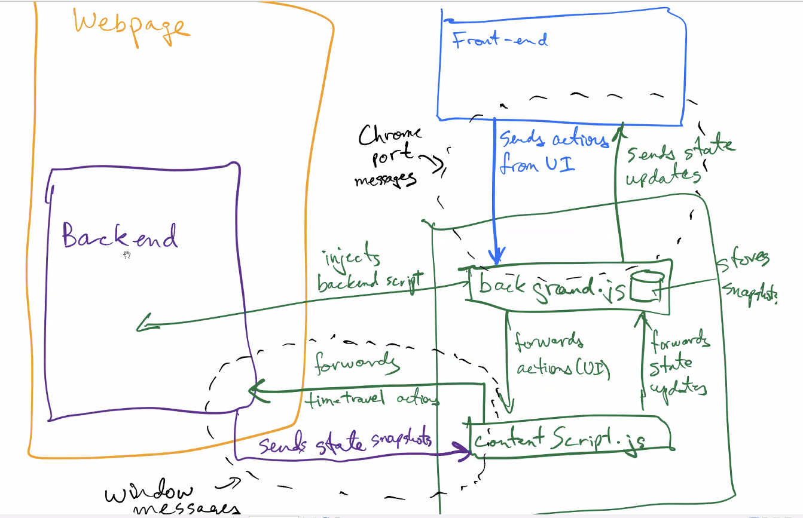

# Reactime v4 Architecture

## Brief
Our mission at Reactime is to maintain and iterate constantly, but never at the expense of future developers.<br />We know how hard it is to quickly get up to speed and onboard in a new codebase.<br />So, here are some helpful pointers to help you hit the ground running. 🏃🏾💨

### Main Structure

In the *src* folder, there are three directories we care about: *app*, *backend*, and *extension*. 
```
src/
├── app/                      # Frontend code
│   │                         #
│   ├── __tests__/            #
│   ├── actions/              # Redux action creators
│   ├── components/           # React components
│   ├── constants/            #
│   ├── containers/           # More React components
│   ├── reducers/             # Redux mechanism for updating state
│   ├── styles/               #
│   ├── index.tsx             # App component 
│   ├── module.d.ts           #
│   └── store.tsx             #
│
├── backend/                  # "Backend" code
│   │                         #
│   ├── __tests__/            #
│   ├── types/                # Typescript interfaces
│   ├── helpers.js            # 
│   ├── index.ts              # Starting point for backend functionality 
│   ├── index.d.ts            # 
│   ├── linkFiber.ts          # 
│   ├── masterState.js        # Component action record interface
│   ├── module.d.ts           #
│   ├── package.json          #
│   ├── puppeteerServer.js    #
│   ├── readme.md             # 
│   ├── timeJump.ts           # Rerenders DOM based on snapshot from background
│   └── tree.ts               # Custom structure to send to background
│
├── extension/                # Chrome Extension code
│   │                         #
│   ├── build/                # Destination for bundles
│   │                         # and manifest.json (Chrome config file)
│   │                         #
│   ├── background.js         # 
│   └── contentScript.ts      # 
└──
```

1. The *app* folder is responsible for the Single Page Application that you see when you open the chrome dev tools under the Reactime tab. 

2. The *backend* folder contains the set of all scripts that we inject into our "target" application via `background.js`
    - In Reactime, its main role is to generate data and handle time-jump requests from the background script in our *extension* folder.

3. The *extension* folder is where the `contentScript.js` and `background.js` are located. 
    - Like regular web apps, Chrome Extensions are event-based. The background script is where one typically monitors for browser triggers (e.g. events like closing a tab, for example). The content script is what allows us to read or write to our target web application, usually as a result of [messages passed](https://developer.chrome.com/extensions/messaging) from the background script.
    - These two files help us handle requests both from the web browser and from the Reactime extension itself

Still unsure about what contents scripts and background scripts do for Reactime, or for a chrome extensions in general?
  - The implementation details [can be found](./extension/background.js) [in the files](./extension/contentScript.ts) themselves.
  - We also encourage you to dive into [the official Chrome Developer Docs](https://developer.chrome.com/home). Some relevant sections are reproduced below:

> Content scripts are files that run in the context of web pages. 
>
> By using the standard Document Object Model (DOM), they are able to **read** details of the web pages the browser visits, **make changes** to them and **pass information back** to their parent extension. ([Source](https://developer.chrome.com/extensions/content_scripts))

- One helpful way to remember a content script's role in the Chrome ecosystem is to think: a *content* script is used to read and modify a target web page's rendered *content*. 

>A background page is loaded when it is needed, and unloaded when it goes idle.
>
> Some examples of events include:
>The extension is first installed or updated to a new version.
>The background page was listening for an event, and the event is dispatched.
>A content script or other extension sends a message.
>Another view in the extension, such as a popup, calls `runtime.getBackgroundPage`.
> 
>Once it has been loaded, a background page will stay running as long as it is performing an action, such as calling a Chrome API or issuing a network request.
>
> Additionally, the background page will not unload until all visible views and all message ports are closed. Note that opening a view does not cause the event page to load, but only prevents it from closing once loaded. ([Source](https://developer.chrome.com/extensions/background_pages))

- You can think of background scripts serving a purpose analogous to that of a **server** in the client/server paradigm. Much like a server, our `background.js` listens constantly for messages (i.e. requests) from two main places:
  1. The content script
  2. The chrome extension "front-end" **(*NOT* the interface of the browser, this is an important distinction.)** 
- In other words, a background script works as a sort of middleman, directly maintaining connection with its parent extension, and acting as a proxy enabling communication between it and the content script. 


### Data Flow

The general flow of data is described in the following steps:



1. When the background bundle is loaded by the browser, it executes a script injection into the dom. (see section on *backend*). This script uses a technique called [throttle](https://medium.com/@bitupon.211/debounce-and-throttle-160affa5457b) to send state data from the app to the content script every specified milliseconds (in our case, this interval is 70ms).

2. The content script always listens for messages being passed from the extension's target application. Upon receiving data from the target app, the content script will immediately forward this data to the background script which then updates an object called `tabsObj`. Each time `tabsObj` is updated, its latest version will be passed to Reactime, where it is processed for displaying to the user by the *app* folder scripts.

3. Likewise, when Reactime emits an action due to user interaction -- a "jump" request for example --  a message will be passed from Reactime via the background script to the content script. Then, the content script will pass a message to the target application containing a payload that represents the state the user wants the DOM to reflect or "jump" to.
    - One important thing to note here is that this jump action must be dispatched in the target application (i.e. *backend* land), because only there do we have direct access to the DOM.
